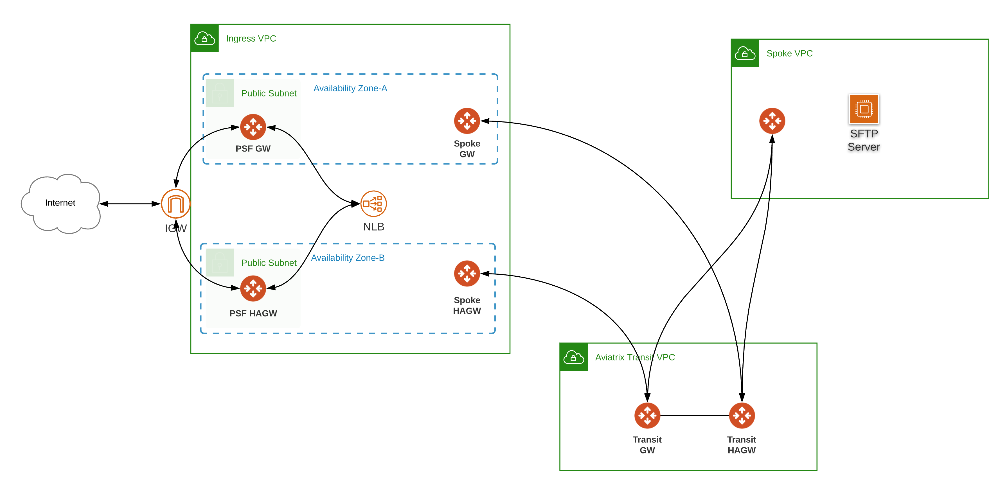
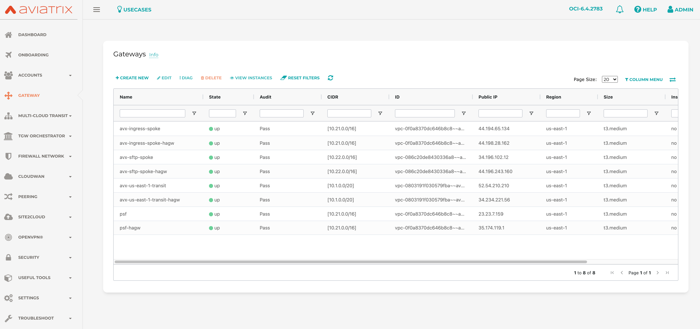

# Aviatrix PSF gateways and Aviatrix Transit with AWS NLB integration

### Modules used

- https://registry.terraform.io/modules/terraform-aviatrix-modules/aws-transit/aviatrix/latest
- https://registry.terraform.io/modules/terraform-aviatrix-modules/aws-spoke/aviatrix/latest
- Drive it by variables as needed
- Set TF_VARs for username, controller_ip, password in your env
  
  
### Infrastructure diagram



### Compatibility
Terraform version | Controller version | Terraform provider version
:--- | :--- | :---
0.13,0.14,0.15 | 6.4.2783 | 2.19.5

### Variables

The variables are defined in ```terraform.tfvars```.

### Prerequisites

- Software version requirements met 
- Aviatrix Controller with Access Account in AWS
- terraform .13 or higher in the user environment ```terraform -v``` 
- AWS terraform provider requirements met 

### Workflow

- Modify ```terraform.tfvars``` _(i.e. access account name, regions, cidrs, etc.)_ and save the file.
- ```terraform init```
- ```terraform plan```
- ```terraform apply --auto-approve```
- ```cd ./02-aws-nlb``` and repeat

### Controller View (post-provisioning)




### Terraform state (post-provisioning) 

```
$ terraform state list
data.aws_route_table.spoke_pub_rt1
data.aws_route_table.spoke_pub_rt2
aviatrix_gateway.avx_psf_gateway_aws
module.spoke_aws_1.aviatrix_spoke_gateway.default
module.spoke_aws_1.aviatrix_spoke_transit_attachment.default[0]
module.spoke_aws_1.aviatrix_vpc.default[0]
module.spoke_aws_2.aviatrix_spoke_gateway.default
module.spoke_aws_2.aviatrix_spoke_transit_attachment.default[0]
module.spoke_aws_2.aviatrix_vpc.default[0]
module.transit_aws_1.aviatrix_transit_gateway.default
module.transit_aws_1.aviatrix_vpc.default
```

